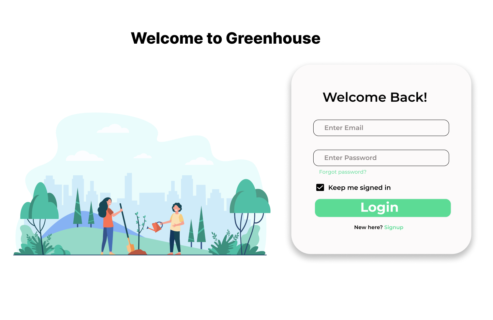
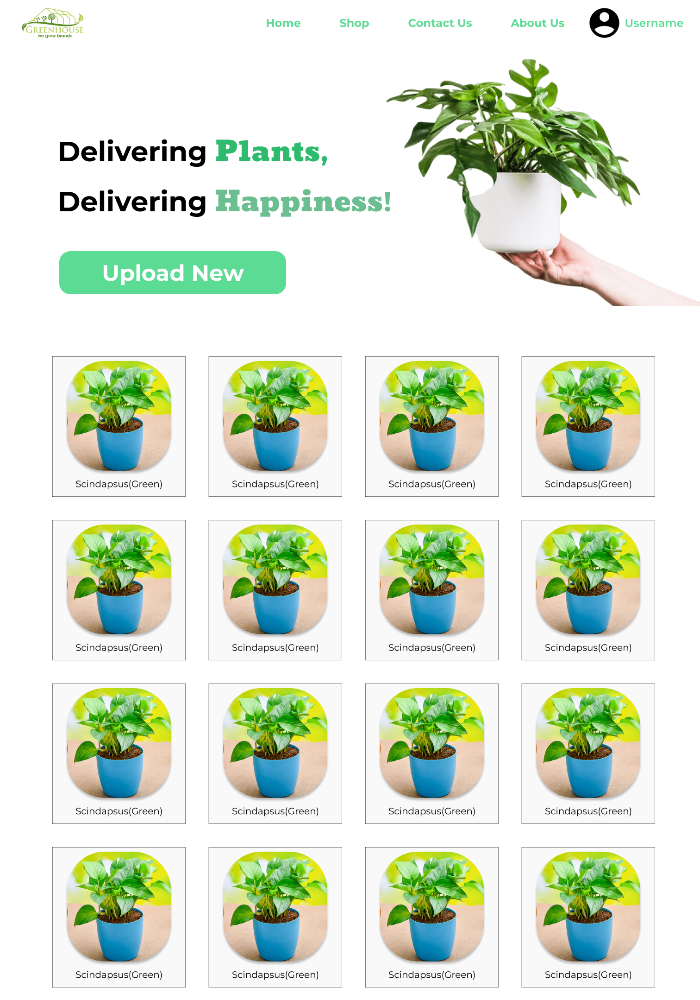
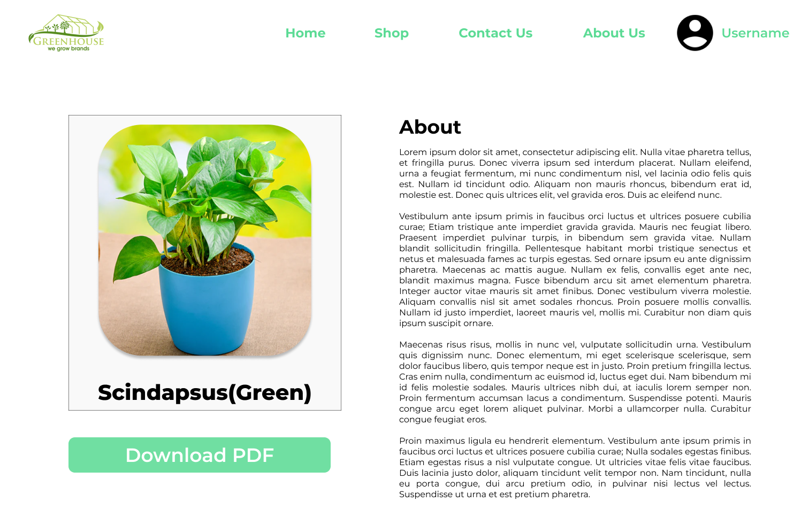
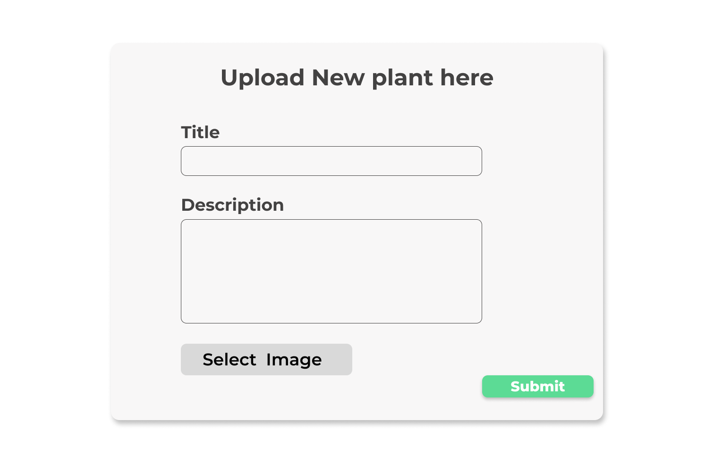

# GreenHome Tech

## Requirements

1) Login page with needed features of registering, password setup, recovery email etc. 
2) The portal should have a front end UI where one can upload images of trees. Also one should be able to write about the tree description in a block. Then save. 
3) The portal should be able to hold as many as 1000 tree details. The image of the tree should be seen in the tiles format.
4) When clicked on any one of them, it should open the tree description. 
5) Download option of the tree images with description in PDF format.

### [View Mockup here](https://www.figma.com/file/HT0qtZRWl8XlWFRHENYcik/Greenverz)

# 1. Sign up Page

# 2. Login Page

# 3. Dashboard Page

# 4. View Page

# 5. Uplaod Page

